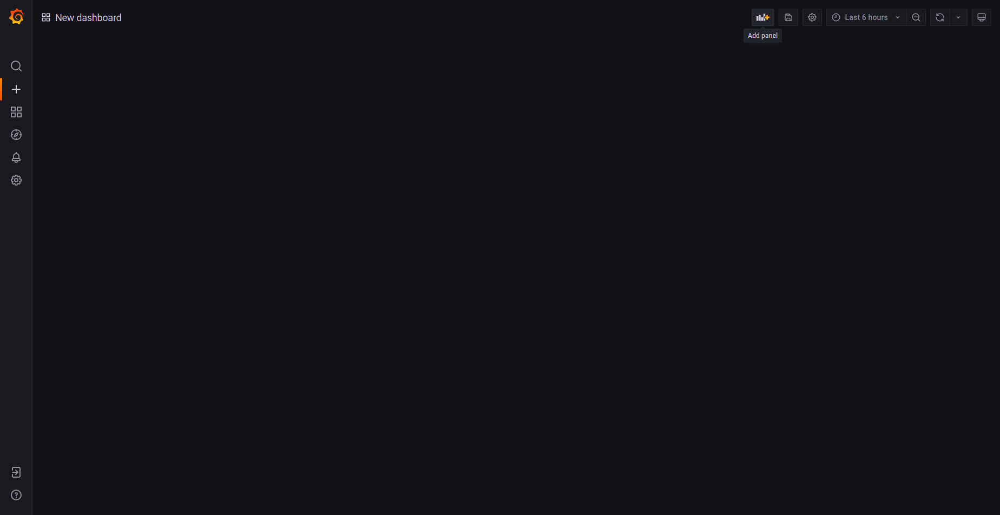
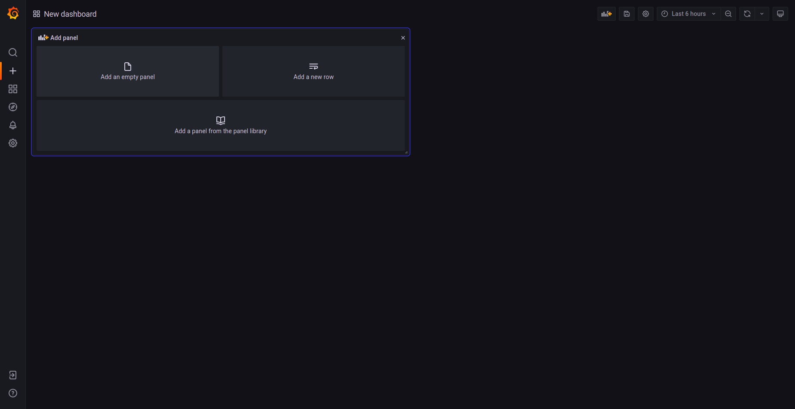

# 0)  Pre-requsites.

For this guide we assume you are running the hello-world example on the client with db turned on, for instance:

`python analysis/hello-world.py --pipeline analysis/pipelines/hello-world-raw.txt --use_db 1`

or

`python analysis/hello-world.py --pipeline analysis/pipelines/hello-world-mjpg.txt --use_db 1`

and we assume your client http server is running, either as a cronjob (you can check this by running crontab -l and see that the job is listed)
or by running `python -m http.server 8080` where the index.html file is located.

further we assume you have populated the correct influx db information in SETUP.yml. Auto generated on the client after running `python initial_setup/create_default_setup.py`

# 1) InfluxDB bucket

Go to SERVER_IP:8086. You should be presented with the InfluxDB login screen. The default credentials are admin:admin123

Once you logged in, go to Data -> Buckets. By default there should be a bucket called bucket. We will use this in this hello world guide, but you should create a bucket for your application with a more descriptive name. 

Make sure the bucket your client will be using is written in SETUP.yml - along with the org, ip, port and token.
To find the token (or generate a client specifit token) go to data -> Tokens. By default there should be an admin's Token. Copy this to the SETUP.yml
 
# 2) Add Grafana support.

## 2.1) Add InfluxDB as a data source
Go to SERVER_IP:3000 to open grafana.

- Go to Configuration -> Data sources -> Add data source and select InfluxDB.

- Fill with the correct information
- Query Language - use Flux
- HTTP - URL - Use http:// in front of the IP. i.e http://SERVER_IP:8086
- InfluxDB Details - Use the same details as in the SETUP.yml file
- Press Save & Test - You should get x number of buckets found and you have now connected InfluxDB to Grafana

## 2.2) Add data graph

Go to the InfluxDB SERVER_IP:8086
- Data -> Buckets -> bucket
- Choose bucket - prediction - person and under aggregate function choose whichever fits your needs, here last is used.

- Choose Script Editor
- Copy the relevant query

Go to Grafana SERVER_IP:3000

- If adding the feed to an existing dashboard, go there, otherwise go to create and press dashboard

- under add panel press "Add an empty panel"

- under data source choose "InfluxDB"

- paste the query you copied from the InfluxDB.
- press Query inspector
- press Apply

You should now have a data graph in the grafana dashboard. Remember to press Save dashboard.