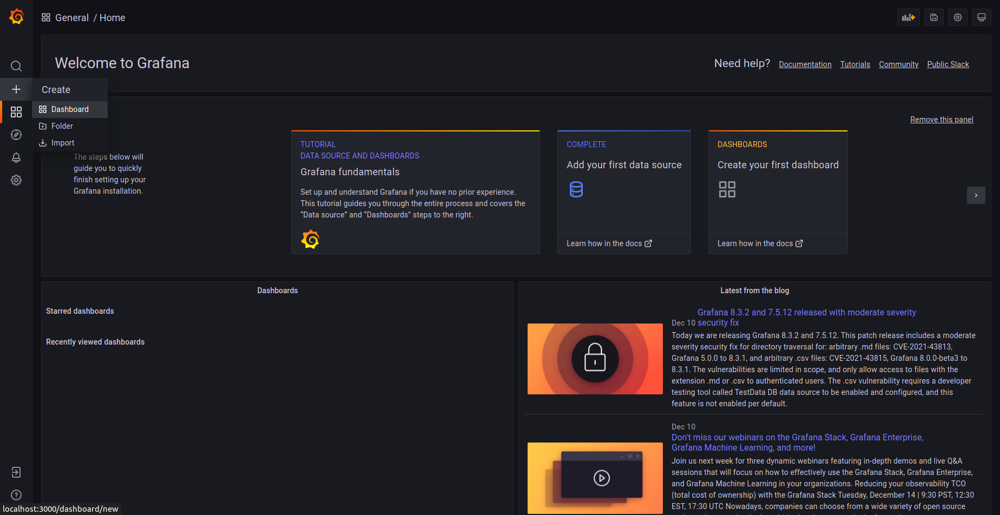
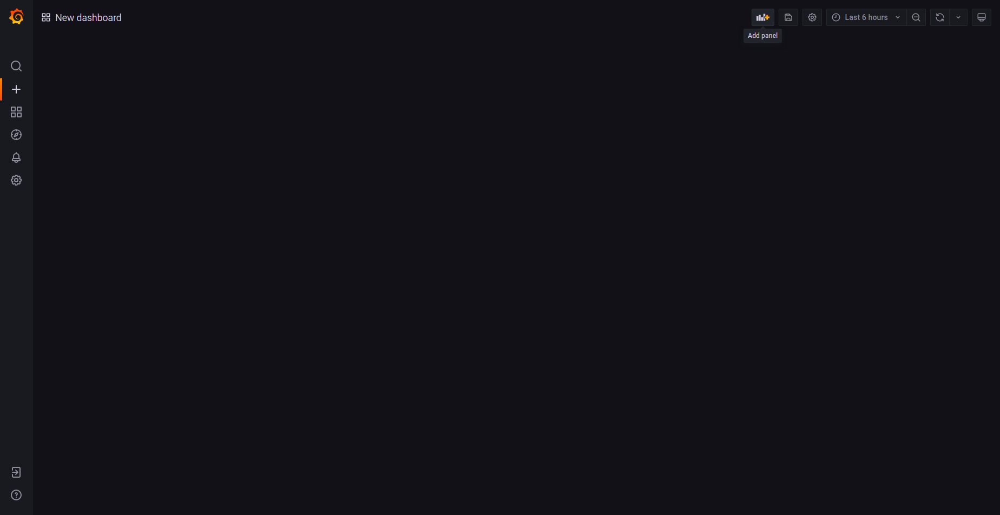
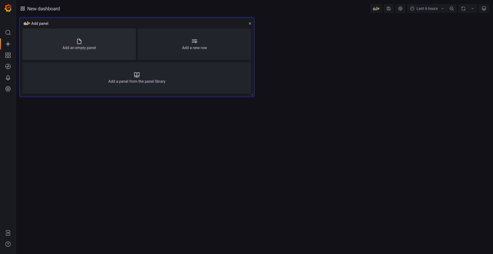
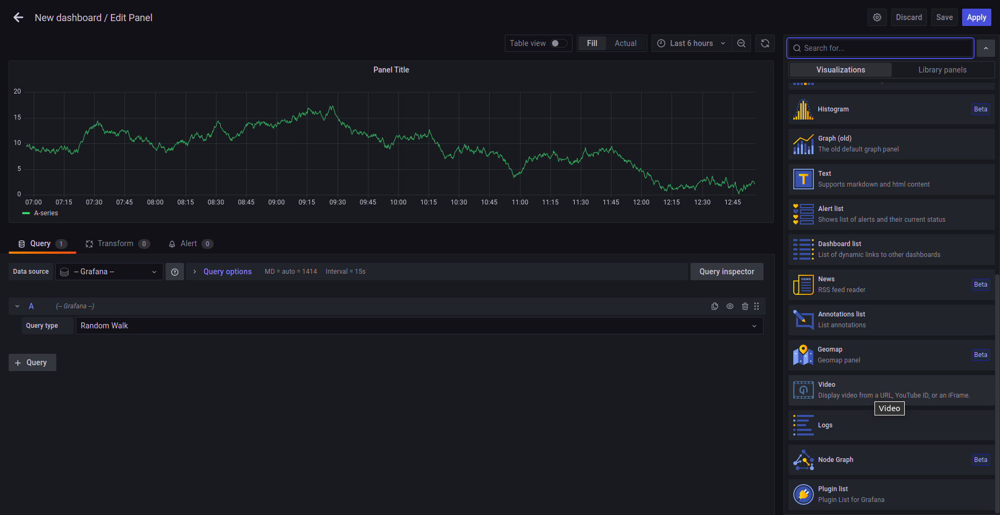
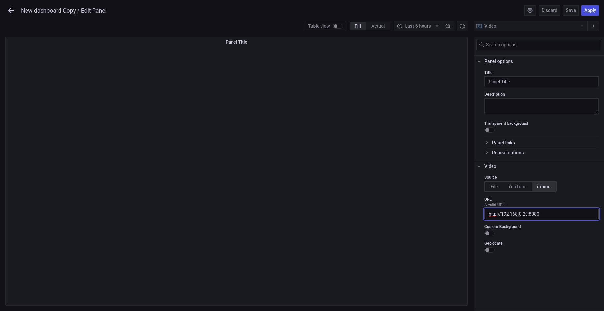
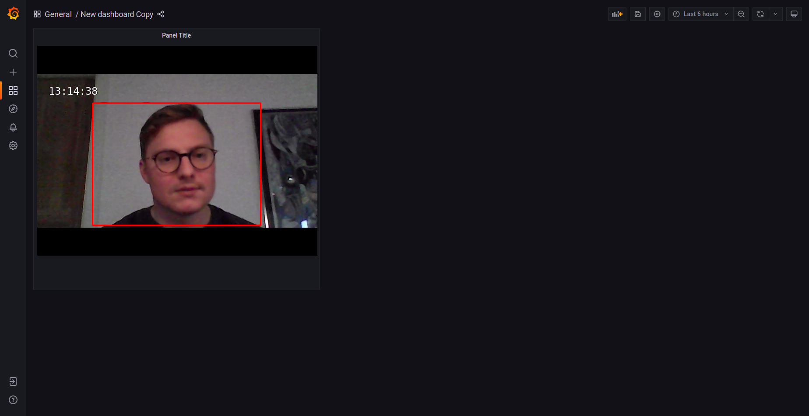

# 0)  Pre-requsites.

For this guide we assume you are running the hello-world example on the client, for instance:

`python analysis/hello-world.py --pipeline analysis/pipelines/hello-world-raw.txt`

or

`python analysis/hello-world.py --pipeline analysis/pipelines/hello-world-mjpg.txt`

and we assume your client http server is running, either as a cronjob (you can check this by running crontab -l and see that the job is listed)
or by running python -m http.server 8080 where the index.html file is located.

# 1) HLS server video feed.

Go to CLIENT_IP:8080, if you can see a video player, the server should be working, if you can see the stream everything should be working.
 
# 2) Add Grafana support.

- Go to SERVER_IP:3000 to open grafana.

- If adding the feed to an existing dashboard, go there, otherwise go to create and press dashboard

- under add panel press "Add an empty panel"

- under change visualization choose "Video"

- under source choose iframe.
- inset http://CLIENT_IP:8080 as url

- press apply

You should now have a video feed window in grafana.

**Note** Since the feed is a hls sink, the feed is delayed approximatly 20 seconds.
